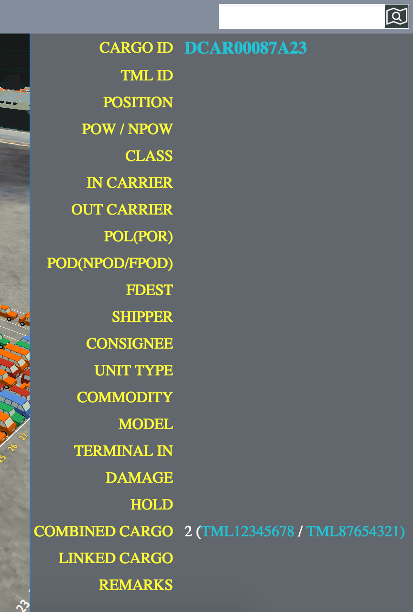

# cartos-detail-popup
CarTOS Detail Popup



## Using
### 1. Include Javascript and Stylesheet
```
<script src="js/cargo-popup.js"></script>
<link type="text/css" href="css/cargo-popup.css" rel="stylesheet">
```
### 2. HTML
```
<div id='container'></div>
```

### 3. Javascript
#### Initialization
```
var isPanelOpen = false;
var $cargoPopup = $('#container').cargoPopup({
    data: [
        ['CARGO ID', '<b style="font-size: 18px;color: #22c4d6;">DCAR00087A23</b>'],
        ['TML ID', ''],
        ['POSITION', ''],
        ['POW / NPOW', ''],
        ['CLASS', ''],
        ['IN CARRIER', ''],
        ['OUT CARRIER', ''],
        ['POL(POR)', ''],
        ['POD(NPOD/FPOD)', ''],
        ['FDEST', ''],
        ['SHIPPER', ''],
        ['CONSIGNEE', ''],
        ['UNIT TYPE', ''],
        ['COMMODITY', ''],
        ['MODEL', ''],
        ['TERMINAL IN', ''],
        ['DAMAGE', ''],
        ['HOLD', ''],
        ['COMBINED CARGO', '2 (<span style="color:#22c4d6;">TML12345678</span> / <span style="color:#22c4d6;">TML87654321)</span>'],
        ['LINKED CARGO', ''],
        ['REMARKS', '']
    ]
});
```

#### Show
```
$cargoPopup.showWithAnimation(!isPanelOpen);
isPanelOpen = !isPanelOpen;
$cargoPopup.bindData();
```

## API 
#### 1. show
`$('#container').show()`
#### 2. hide
`$('#container').hide()`
#### 3. showWithAnimation
`$cargoPopup.showWithAnimation(!isPanelOpen);`